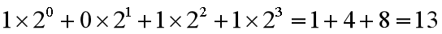
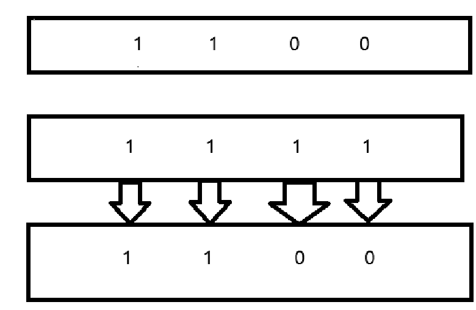

> 在 Java 中，位运算（Bitwise Operations）是指直接对整数的二进制位进行操作。
> 位运算通常用于优化计算或处理二进制数据。
> Java 支持多种位运算符，包括按位与 (&、按位或 (|、按位异或 (^)、按位取反 (~)、左移 (<<) 和右移 (>> 或 >>>)。
>
****
### 常见的位运算符
1. **按位与 (**`&`**)**：
    - 结果的每一位只有在两个操作数的相应位都是 1 时才是 1。
2. **按位或 (**`|`**)**：
    - 结果的每一位只要有一个操作数的相应位是 1 就是 1。
3. **按位异或 (**`^`**)**：
    - 结果的每一位只有在两个操作数的相应位不相同时才是 1。
4. **按位取反 (**`~`**)**：
    - 将一个整数的每一位取反，即 0 变 1，1 变 0。
5. **左移 (**`<<`**)**：
    - 将一个整数向左移动指定的位数，高位溢出的部分被丢弃，低位补零。
6. **算术右移 (**`>>`**)**：
    - 将一个整数向右移动指定的位数，符号位（最高位）保持不变，低位溢出的部分被丢弃。
7. **逻辑右移 (**`>>>`**)**：
    - 将一个整数向右移动指定的位数，高位补零，低位溢出的部分被丢弃。

****
### 10进制转二进制算法

迭代法（通过不断除以 2 并记录每次的余数来实现转换，最后将记录的余数倒序排列就是二进制表示）：

例如一个数字12

    1. 除以2，得到商6，余数0，商大于0，继续除；
    2. 除以2，得到商3，余数0，3>0;
    3. 除以2，得到商1，余数1，1>0;
    4. 除以2，得到商0，余数1，0不大于0，结束；
    5. 得到结果0，0，1，1，然后倒序得到1100就是二进制数

****
### 二进制转10进制算法

**按位与 (**`&`**)**：
数字12和数字15，转换二进制分别是，1100，1111，根据按位与规则：

从右往左，0和1，只有一个是，位数值为0，以此类推，得到1100，也就是数字12。

****
### 补充：
> 1 & 0xFF，取二进制低8位，1二进制为（00000001），0xFF是一个16进制（1111111），然后进行按位与（相同为1，不同为0）操作得到（00000001），也就是1.
>
> 1<<1,相当于1的二进制左移1位，计算方式为（1<<n，1*(2^n)）,结果是2
>
> 1>>24，相当于把1的二进制右移24位，相当于把高位8位移到低位8位去了，再配合(&  0xFF)获取低8位

****

**完结！**

