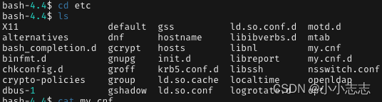
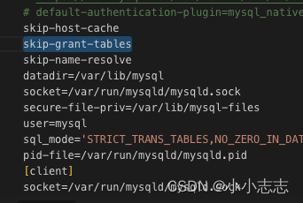
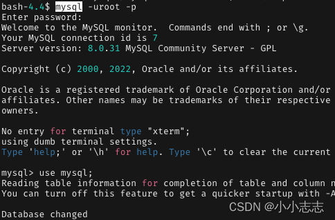
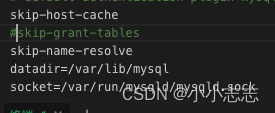
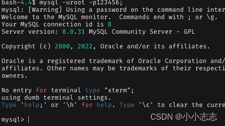

#####  最直接办法是重新部署个容器，但是这样就要重新配置了，有点麻烦。


### 另外一种方法

#### 1.先进入到容器内部，找到mysql的配置文件my.cnf,我的是mysql8，路径是在/etc/my.cnf。

```bash
docker exec -it mysql8 bash
```

#### 2. 另起一个窗口把容器内配置复制出来（如果已经挂载的话直接改宿主机的配置文件即可，跳到第三点）。


```bash
docker cp 容器长ID:docker容器路径 你的文件路径  #复制出来
docker cp 你的文件路径 容器长ID:docker容器路径  #复制到容器
```
#### 3.修改配置文件，在配置文件加入**skip-grant-tables**。

#### 4.把文件复制进去后，重启mysql容器，在进入容器内部，直接mysql -uroot -p,不需要输入密码，直接enter。

接下来输入命令

```bash
flush privileges;
alter user 'root'@'%' IDENTIFIED WITH caching_sha2_password BY '123456';  
#@之后对的‘%’根据你的实际情况来，有些人是localhost。
# caching_sha2_password为mysql8默认验证插件，mysql_native_password为mysql5的默认验证插件
```
#### 5.然后把配置文件添加的语句注释掉，重启容器，重新输入密码，完成。




**完结！**