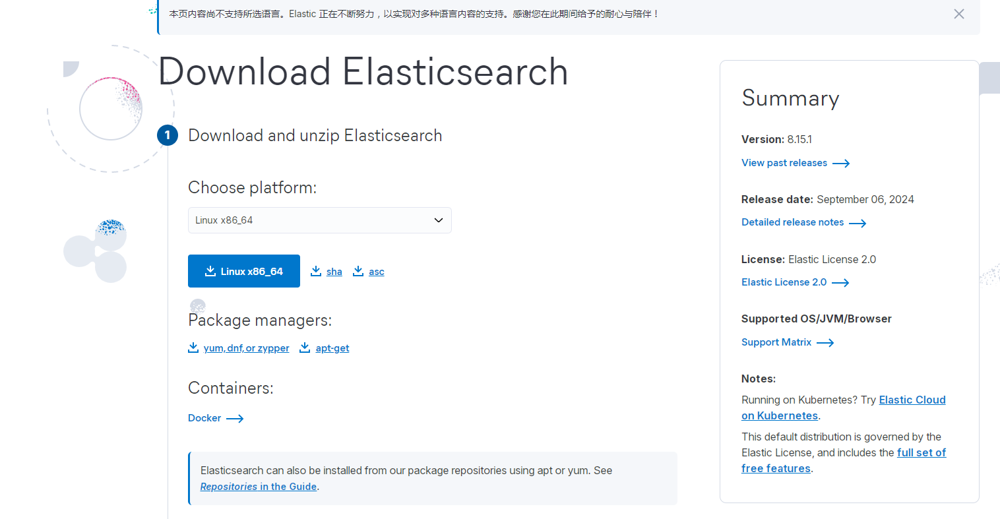
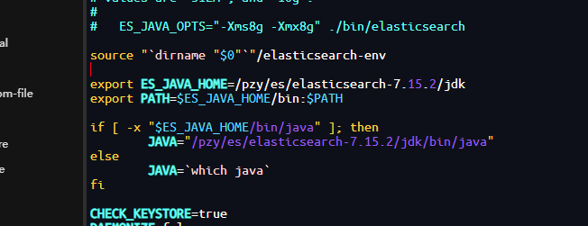
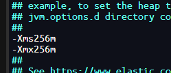

> 版本：7.15.2


## 1. **检查内核**

```base
uname -a
uname -m
```

## 2. **下载版本**

**下载版本选择自己服务器对应的内核版本，我这边是x86_64**

> [ES下载地址](https://www.elastic.co/cn/downloads/elasticsearch)
>



- 默认下载最新版本，需要下载其他版本链接时修改其**版本号**以及**内核版本**：  
[https://artifacts.elastic.co/downloads/elasticsearch/elasticsearch-7.15.2-linux-x86_64.tar.gz](https://artifacts.elastic.co/downloads/elasticsearch/elasticsearch-7.15.2-linux-x86_64.tar.gz)


## 3. **上传服务器解压**

```c
tar -zxvf elasticsearch-7.15.2-linux-x86_64.tar.gz
```


## 4.安装ES

因为ES不能root用户启动，需要创建一个账号

```kotlin
//新增es用户
useradd  es
//为es用户设置密码
passwd  es
//如果错了，可以删除再加
userdel   -r  es
//为es文件夹修改所有者用户，root改为es
chown   -R  es:es  /pzy/es/elasticsearch-7.15.2
```

**注意：用ll命令查看一下elasticsearch-7.15.2文件夹及下面文件夹和文件的所有者是不是es用户，如果是root按照chown命令修改其所有者。**

****

## **5.修改相关配置**

- 修改/pzy/es/[elasticsearch](https://so.csdn.net/so/search?q=elasticsearch&spm=1001.2101.3001.7020)-7.15.2/config下elasticsearch.yml文件。


```base
#编辑文件
vim /pzy/es/elasticsearch-7.15.2/config/elasticsearch.yml
 
 
 
# 加入如下配置
cluster.name: elasticsearch
#数据存放路径
path.data: ./data 
#日志存放路径
path.logs: /pzy/es/elasticsearch-7.15.2/data/logs 
node.name: node-1
#本机IP地址（设置可以访问的ip地址）
network.host: 0.0.0.0
#es暴露对外的端口
http.port: 9200
cluster.initial_master_nodes: ["node-1"]
```

## **6.解决es强依赖jdk问题**

由于es和jdk是一个强依赖的关系，所以当我们在新版本的ElasticSearch压缩包中包含有自带的jdk，但是当我们的Linux中已经安装了jdk之后，就会发现启动es的时候优先去找的是Linux中已经装好的jdk，此时如果jdk的版本不一致，就会造成jdk不能正常运行


**注：如果Linux服务本来没有配置JDK，则会直接使用ES目录下默认的JDK，反而不会报错。如果Linux安装了JDK，不指定JDK会报错**


- 修改/pzy/es/elasticsearch-7.15.2/bin下elasticsearch文件。

```base
vim elasticsearch


export ES_JAVA_HOME=/pzy/es/elasticsearch-7.15.2/jdk
export PATH=$ES_JAVA_HOME/bin:$PATH
 
if [ -x "$ES_JAVA_HOME/bin/java" ]; then
        JAVA="/pzy/es/elasticsearch-7.15.2/jdk/bin/java"
else
        JAVA=`which java`
fi
```




## **7.修改jdk内存大小**


```base
su es   //切换到es用户
```

- 修改/pzy/es/elasticsearch-7.15.2/config/jvm.options



> #后台启动命令
> bin/elasticsearch -d


## **8.ES启动失败错误解决**

- max file descriptors [4096] for [**elasticsearch**](https://link.zhihu.com/?target=https%3A//so.csdn.net/so/search%3Fq%3Delasticsearch%26spm%3D1001.2101.3001.7020) process is too low, increase to at least [65536]

```base
vim /etc/security/limits.conf

#在文件末尾插入
es soft nofile 65536
es hard nofile 65536
```

- max virtual memory areas vm.max_map_count [65530] is too low, increase to at least [262144]

```base
vim /etc/sysctl.conf

vm.max_map_count=262144
```

**完结！**