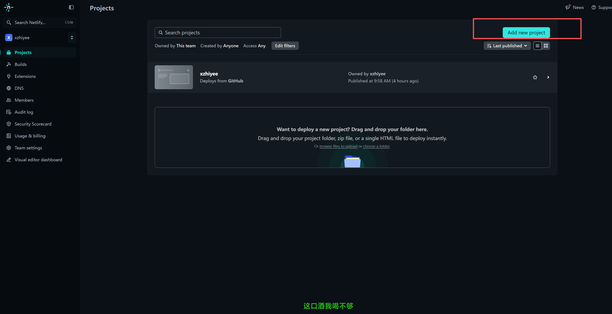
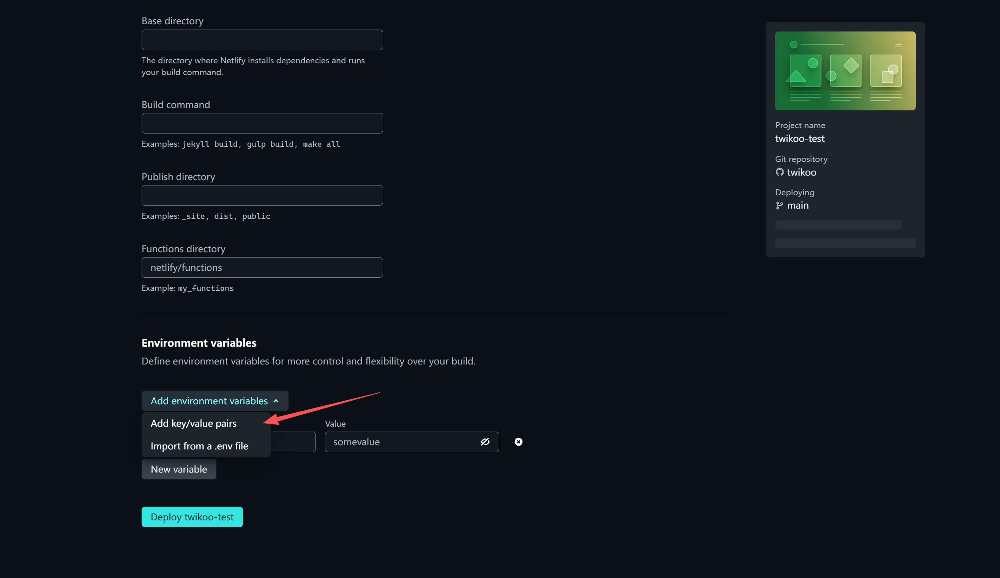
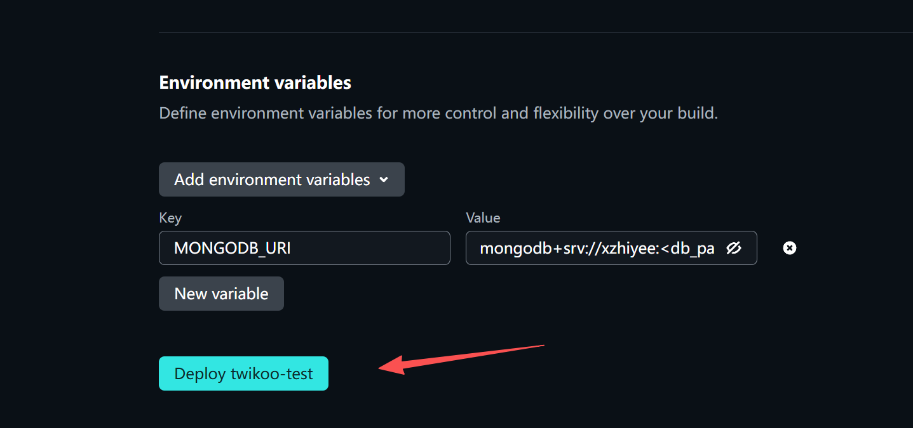
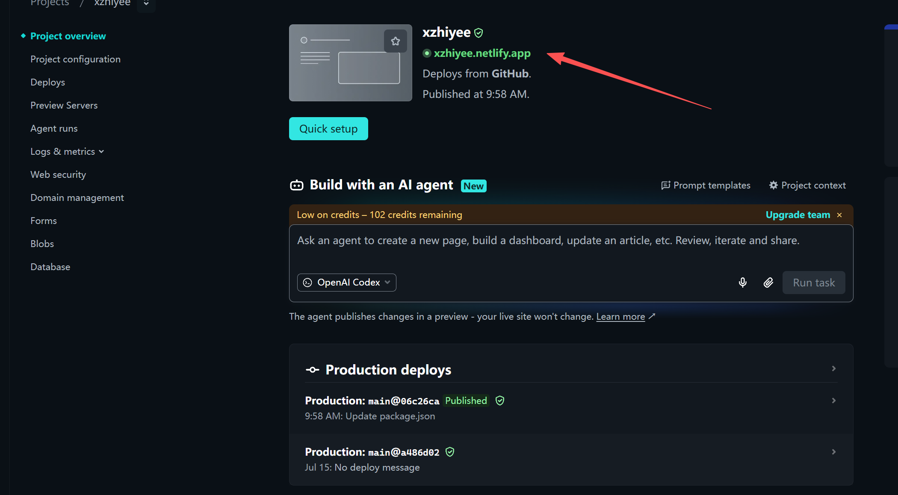
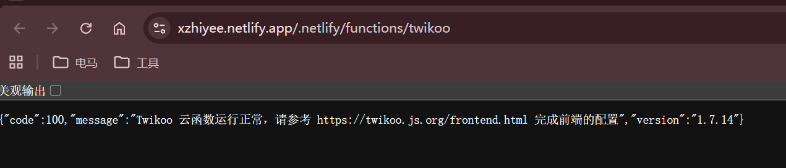
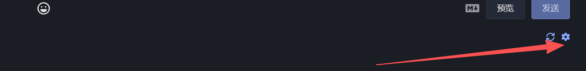

> 打开[twikoo文档地址](https://twikoo.js.org/)，里面各种部署方式，当前博客网站使用Netlify 部署

## **Netlify 部署**
#### 1. 申请MongoDB Atlas账号，获取链接字符串，按照此网址下操作流程来（[https://twikoo.js.org/mongodb-atlas.html](https://twikoo.js.org/mongodb-atlas.html)）,
    - 得到类似（**mongodb+srv://xzhiyee:<db_password>@xhiyee.uqxwzmr.mongodb.net/?appName=xxxxx**）链接字符串。

#### 2. 去github搜索[twikoo-netlify](https://github.com/twikoojs/twikoo-netlify)仓库，fork到自己仓库。

#### 3. 创建[Netlify账号](https://app.netlify.com/)，点击Add new project，选择github导入，并选择第一步fork的仓库名称。、
   
#### 4. 导入之后第三步添加链接字符串，key值输入：**MONGODB_URI**，value值输入：MongoDB链接字符串。
   
   

#### 5. 点击部署之后，点击如下网址打开，如图所示为成功。
   
   

#### 6. 刷新你的博客，找到评论位置，点击齿轮图标，第一次需要输入注册密码，设置一个自己记住的密码。
   

**完结！**